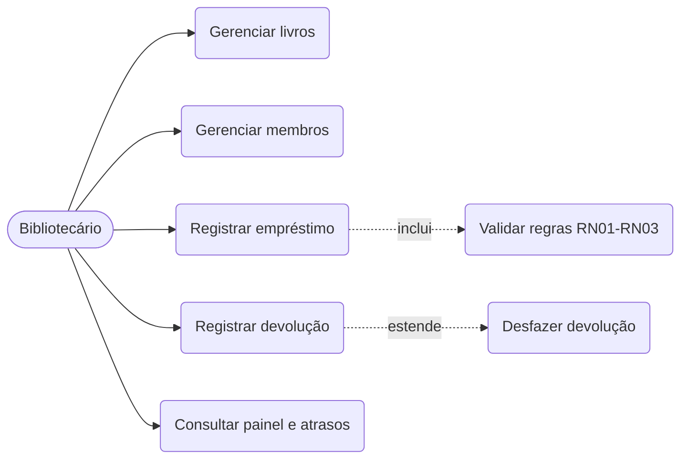
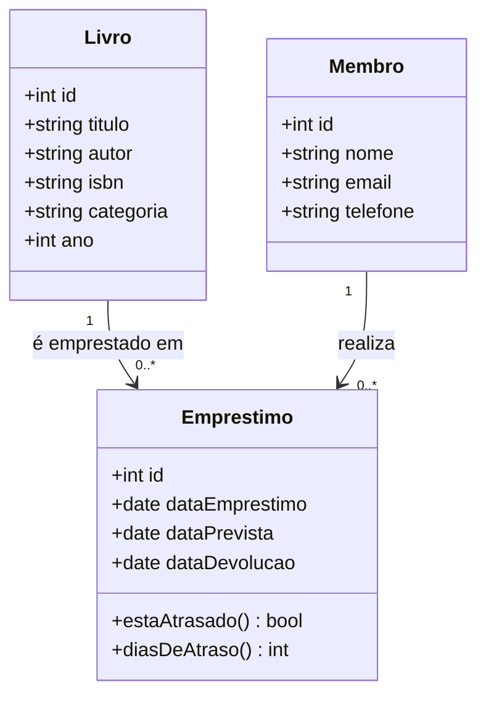
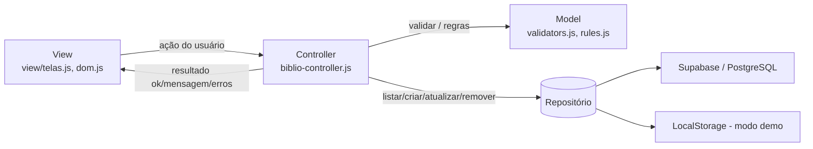
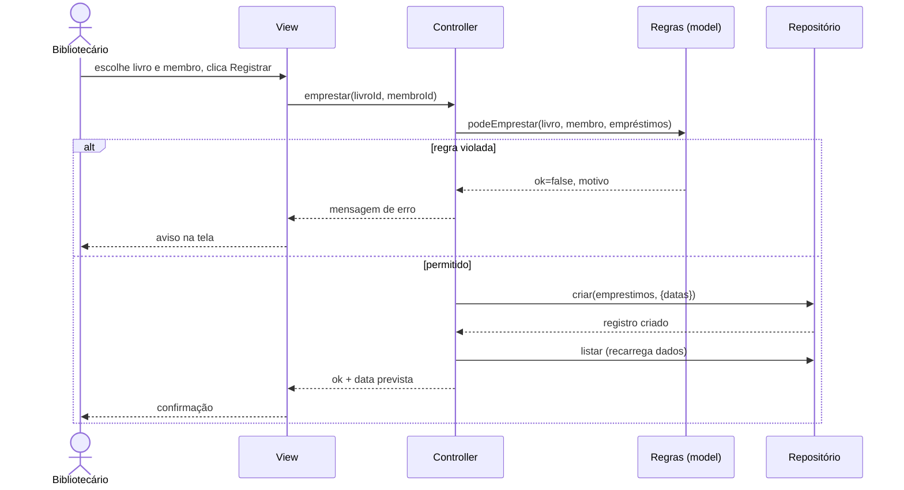
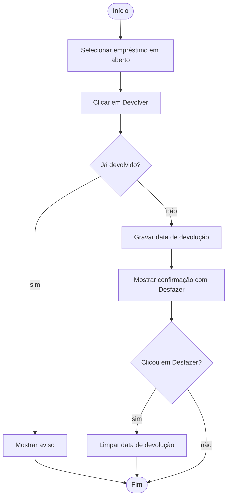

# 2. Modelagem UML

## 2.1 Casos de uso

```mermaid
flowchart LR
  B([Bibliotecário])
  B --> UC1(Gerenciar livros)
  B --> UC2(Gerenciar membros)
  B --> UC3(Registrar empréstimo)
  B --> UC4(Registrar devolução)
  B --> UC5(Consultar painel e atrasos)
  UC3 -. inclui .-> V1(Validar regras RN01-RN03)
  UC4 -. estende .-> D1(Desfazer devolução)
```

## 2.2 Diagrama de classes (modelo de domínio)

```mermaid
classDiagram
  class Livro {
    +int id
    +string titulo
    +string autor
    +string isbn
    +string categoria
    +int ano
  }
  class Membro {
    +int id
    +string nome
    +string email
    +string telefone
  }
  class Emprestimo {
    +int id
    +date dataEmprestimo
    +date dataPrevista
    +date dataDevolucao
    +estaAtrasado() bool
    +diasDeAtraso() int
  }
  Livro "1" --> "0..*" Emprestimo : é emprestado em
  Membro "1" --> "0..*" Emprestimo : realiza
```

## 2.3 Arquitetura MVC

```mermaid
flowchart LR
  V[View<br/>view/telas.js, dom.js] -->|ação do usuário| C[Controller<br/>biblio-controller.js]
  C -->|validar / regras| M1[Model<br/>validators.js, rules.js]
  C -->|listar/criar/atualizar/remover| R[(Repositório)]
  R --> S[Supabase / PostgreSQL]
  R --> L[LocalStorage - modo demo]
  C -->|resultado ok/mensagem/erros| V
```

## 2.4 Sequência – registrar empréstimo

```mermaid
sequenceDiagram
  actor U as Bibliotecário
  participant V as View
  participant C as Controller
  participant M as Regras (model)
  participant R as Repositório
  U->>V: escolhe livro e membro, clica Registrar
  V->>C: emprestar(livroId, membroId)
  C->>M: podeEmprestar(livro, membro, empréstimos)
  alt regra violada
    M-->>C: ok=false, motivo
    C-->>V: mensagem de erro
    V-->>U: aviso na tela
  else permitido
    C->>R: criar(emprestimos, {datas})
    R-->>C: registro criado
    C->>R: listar (recarrega dados)
    C-->>V: ok + data prevista
    V-->>U: confirmação
  end
```

## 2.5 Atividade – devolução

```mermaid
flowchart TD
  A([Início]) --> B[Selecionar empréstimo em aberto]
  B --> C[Clicar em Devolver]
  C --> D{Já devolvido?}
  D -- sim --> E[Mostrar aviso] --> Z([Fim])
  D -- não --> F[Gravar data de devolução]
  F --> G[Mostrar confirmação com Desfazer]
  G --> H{Clicou em Desfazer?}
  H -- sim --> I[Limpar data de devolução] --> Z
  H -- não --> Z
```
